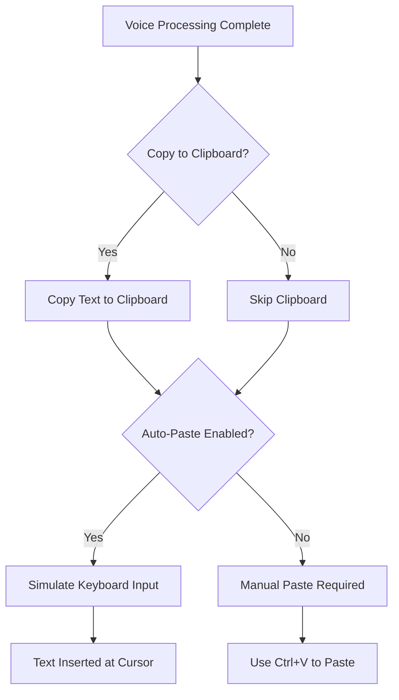

# Clipboard Workflow

SlasshyWispr provides flexible output options for delivering transcriptions and AI responses. Whether you prefer automatic pasting or manual clipboard control, the clipboard workflow adapts to your needs.

## How Clipboard Workflow Works

After processing your voice input, SlasshyWispr can deliver the result in multiple ways:



### Output Settings

Three key settings control the clipboard workflow:

```typescript
interface PersistedSettings {
  autoPasteDictation: boolean;  // Auto-paste after dictation
  copyToClipboard: boolean;     // Copy result to clipboard
  // ... other settings
}
```

| Setting | Effect |
|---------|--------|
| `copyToClipboard: true` | Transcription/response is copied to clipboard |
| `autoPasteDictation: true` | Text is automatically pasted at cursor position |
| Both enabled | Text is copied AND auto-pasted (recommended) |
| Both disabled | Text only appears in SlasshyWispr UI |

<Tip>
Enable both settings for the best experience: immediate pasting with a clipboard backup for flexibility.
</Tip>

## Auto-Paste vs Manual Paste

<Tabs>
  <Tab title="Auto-Paste Workflow">
    **Auto-Paste** simulates keyboard input to insert text automatically.
    
    ### How It Works
    1. You complete dictation or assistant query
    2. SlasshyWispr processes the audio
    3. Result is copied to clipboard (if enabled)
    4. SlasshyWispr simulates `Ctrl+V` or types the text
    5. Text appears at your cursor position
    
    ### When to Use
    - ✅ Writing documents or emails
    - ✅ Filling forms or text fields
    - ✅ Fast drafting workflows
    - ✅ Continuous dictation sessions
    
    ### When to Avoid
    - ❌ Password or sensitive fields
    - ❌ Applications that block paste simulation
    - ❌ When you need to review before inserting
    
    <Note>
    Some applications (browsers, secure fields) may block automated paste. Use manual paste in these cases.
    </Note>
  </Tab>
  
  <Tab title="Manual Paste Workflow">
    **Manual Paste** gives you full control over when and where text is inserted.
    
    ### How It Works
    1. You complete dictation or assistant query
    2. SlasshyWispr processes the audio
    3. Result is copied to clipboard
    4. You press `Ctrl+V` to paste when ready
    5. Text appears at your chosen location
    
    ### When to Use
    - ✅ Review text before inserting
    - ✅ Paste into multiple locations
    - ✅ Sensitive content (passwords, private data)
    - ✅ Applications that block auto-paste
    
    ### Benefits
    - Full control over paste timing
    - Review and edit before insertion
    - No risk of auto-paste in wrong field
    - Works in all applications
    
    <Tip>
    Disable `autoPasteDictation` but keep `copyToClipboard` enabled for manual paste workflow.
    </Tip>
  </Tab>
</Tabs>

## Copy to Clipboard Option

The `copyToClipboard` setting controls whether results are placed on the system clipboard:

### Clipboard Enabled (`copyToClipboard: true`)

```typescript
interface PersistedSettings {
  copyToClipboard: boolean;  // Default: varies
}
```

**Behavior:**
- Transcription/response is copied to system clipboard
- Text replaces previous clipboard content
- Available for pasting with `Ctrl+V` in any app
- Persists until next clipboard operation

**Use cases:**
- Paste text into multiple locations
- Share transcription with other applications
- Keep text available for later use
- Manual paste workflow preference

### Clipboard Disabled (`copyToClipboard: false`)

**Behavior:**
- Text is NOT copied to clipboard
- Result only visible in SlasshyWispr UI
- Auto-paste may still work (simulates typing instead of Ctrl+V)
- Clipboard remains unchanged

**Use cases:**
- Preserve existing clipboard content
- Privacy - avoid clipboard logging/monitoring
- When using only auto-paste functionality

<Info>
With `copyToClipboard: false` and `autoPasteDictation: true`, SlasshyWispr simulates typing instead of pasting to avoid touching the clipboard.
</Info>

## Integration with Other Apps

SlasshyWispr's clipboard workflow integrates seamlessly with any application that accepts text input:

### Compatible Applications

<Tabs>
  <Tab title="Text Editors">
    **Text Editors & IDEs**
    
    - Visual Studio Code
    - Sublime Text
    - Notepad++
    - Microsoft Word
    - Google Docs
    - Notion
    
    **Works best with:** Auto-paste enabled for continuous dictation
  </Tab>
  
  <Tab title="Communication">
    **Communication Platforms**
    
    - Slack
    - Discord
    - Microsoft Teams
    - Email clients (Outlook, Gmail)
    - Messaging apps
    
    **Works best with:** Manual paste for review before sending
  </Tab>
  
  <Tab title="Browsers">
    **Web Browsers**
    
    - Chrome / Edge / Firefox
    - Web forms
    - Content management systems
    - Social media platforms
    
    **Works best with:** Clipboard copy enabled; auto-paste may be blocked
    
    <Note>
    Some web applications block automated paste for security. Use manual paste (`Ctrl+V`) if auto-paste fails.
    </Note>
  </Tab>
  
  <Tab title="Development">
    **Development Tools**
    
    - Terminal / Command prompt
    - Database clients
    - API testing tools (Postman)
    - Jupyter notebooks
    
    **Works best with:** Manual paste to avoid accidental command execution
  </Tab>
</Tabs>

### Application-Specific Behavior

| Application Type | Auto-Paste Support | Recommended Settings |
|------------------|-------------------|---------------------|
| **Text Editors** | ✅ Full support | Auto-paste: ON, Clipboard: ON |
| **Browsers** | ⚠️ Limited (security) | Auto-paste: OFF, Clipboard: ON |
| **Terminals** | ⚠️ Use with caution | Auto-paste: OFF, Clipboard: ON |
| **Password Fields** | ❌ Blocked | Auto-paste: OFF, Clipboard: OFF |
| **Office Apps** | ✅ Full support | Auto-paste: ON, Clipboard: ON |
| **Chat Apps** | ✅ Usually works | Auto-paste: OFF (review first) |

## Workflow Configurations

Choose a configuration that matches your use case:

### Configuration 1: Fast Drafting (Recommended)

```typescript
const settings: PersistedSettings = {
  autoPasteDictation: true,
  copyToClipboard: true,
  // ...
};
```

**Best for:** Writing documents, emails, notes  
**Behavior:** Text is copied to clipboard AND auto-pasted  
**Benefits:** Maximum speed with clipboard backup

### Configuration 2: Review Before Insert

```typescript
const settings: PersistedSettings = {
  autoPasteDictation: false,
  copyToClipboard: true,
  // ...
};
```

**Best for:** Sensitive content, messaging, forms  
**Behavior:** Text copied to clipboard, manual paste with `Ctrl+V`  
**Benefits:** Full control, review before inserting

### Configuration 3: Private Mode

```typescript
const settings: PersistedSettings = {
  autoPasteDictation: false,
  copyToClipboard: false,
  incognitoMode: true,
  // ...
};
```

**Best for:** Maximum privacy, avoiding clipboard monitoring  
**Behavior:** Text only in SlasshyWispr UI, manual copy if needed  
**Benefits:** No clipboard exposure, no auto-paste tracking

### Configuration 4: Multi-Paste Workflow

```typescript
const settings: PersistedSettings = {
  autoPasteDictation: false,
  copyToClipboard: true,
  // ...
};
```

**Best for:** Pasting transcription into multiple locations  
**Behavior:** One transcription → paste many times  
**Benefits:** Reusable clipboard content

## Clipboard and Context Awareness

When using [Assistant Mode](/features/assistant-mode) with context awareness:

```typescript
interface PersistedSettings {
  contextAwareness: boolean;  // Capture selected text
}

interface AssistantPipelineResponse {
  selectionRewrite: boolean;         // Rewriting selection
  selectionContextUsed: boolean;     // Context included in prompt
  assistantResponse: string;         // AI response text
}
```

### Rewrite Workflow

1. **Select text** in any application
2. **Activate assistant mode** (wake word or command hotkey)
3. **Speak command:** "Make this more professional"
4. **AI generates rewrite** based on selection + command
5. **Result copied to clipboard** (if enabled)
6. **Auto-paste replaces selection** (if enabled) OR manual paste

<Tip>
For selection rewriting, enable auto-paste to automatically replace the selected text with the AI rewrite.
</Tip>

## Foreground Application Detection

SlasshyWispr detects the active application to optimize paste behavior:

```typescript
interface ForegroundInputBlockStatus {
  blocked: boolean;      // Is paste blocked in foreground app?
  processName: string;   // Name of foreground process
}
```

### Blocked Applications

Some applications block automated paste for security:
- Password managers
- Banking applications
- Secure terminals
- Some browser password fields

**When detected:** SlasshyWispr warns you and falls back to clipboard-only mode.

## Clipboard Monitoring and Privacy

### Clipboard Security Considerations

<Note>
Clipboard content can be accessed by other applications. Consider privacy when dictating sensitive information.
</Note>

**Privacy tips:**
- Use `incognitoMode: true` for sensitive content
- Disable `copyToClipboard` when handling passwords/secrets
- Clear clipboard after pasting sensitive data
- Be aware of clipboard monitoring tools on your system

### Incognito Mode

```typescript
interface PersistedSettings {
  incognitoMode: boolean;  // Enhanced privacy mode
}
```

When enabled:
- Forces local/offline processing (no cloud APIs)
- Can disable clipboard operations
- No history logging
- Maximum privacy protection

Configure in **Settings > General**.

## History and Transcript Access

Even without clipboard/auto-paste, transcriptions are available in the SlasshyWispr UI:

```typescript
interface HomeHistoryEntry {
  speaker: string;      // "user" or assistant name
  content: string;      // Transcript or response
  tone: "assistant" | "user";  // Entry type
  timestamp: number;    // Unix timestamp
}
```

**View history:**
- Open SlasshyWispr main window
- Navigate to **Home** tab
- See recent transcriptions and responses
- Copy from history manually if needed

History limit: `MAX_HISTORY_ITEMS = 12`

## Troubleshooting

### Auto-Paste Not Working

**Possible causes:**
- Application blocks automated paste (browser security field)
- Incorrect foreground window detection
- Hotkey conflict preventing paste simulation

**Solutions:**
1. Enable `copyToClipboard` and paste manually with `Ctrl+V`
2. Check foreground application permissions
3. Try typing-based paste (disable clipboard, enable auto-paste)

### Clipboard Content Not Updating

**Possible causes:**
- `copyToClipboard: false` in settings
- Clipboard manager blocking updates
- Permission issues on some systems

**Solutions:**
1. Enable `copyToClipboard` in **Settings > General**
2. Check clipboard manager settings
3. Verify SlasshyWispr has clipboard access permissions

### Text Pasted in Wrong Location

**Possible causes:**
- Focus changed between dictation and paste
- Application doesn't accept paste at cursor

**Solutions:**
1. Use manual paste workflow for better control
2. Ensure target application has focus before starting dictation
3. Use single-tap mode to dictate, then click target field before release

## Best Practices

1. **Enable Both Settings** - Use `copyToClipboard: true` and `autoPasteDictation: true` for best experience
2. **Review Sensitive Content** - Disable auto-paste when dictating passwords or private data
3. **Test with Your Apps** - Some applications block auto-paste; test and adjust settings
4. **Use Incognito for Privacy** - Enable incognito mode when handling confidential information
5. **Keep History Enabled** - Access past transcriptions from SlasshyWispr UI if clipboard is lost

## Configuration Guide

Access clipboard settings in **Settings > General**:

1. Open SlasshyWispr
2. Click **Settings** (gear icon)
3. Navigate to **General** tab
4. Configure:
   - **Auto-Paste Dictation** toggle
   - **Copy to Clipboard** toggle
   - **Incognito Mode** toggle (privacy)

Settings persist across sessions.

## Related Features

- [Voice Dictation](/features/voice-dictation) - Basic dictation workflow and output
- [Assistant Mode](/features/assistant-mode) - AI responses and selection rewriting
- [Runtime Modes](/features/runtime-modes) - Online/offline processing affects output delivery
