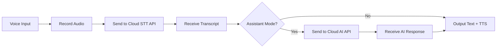
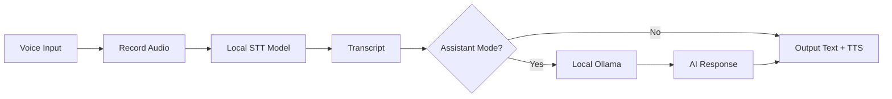

# Runtime Modes

SlasshyWispr supports three runtime modes for both speech-to-text (STT) and AI processing: **Online**, **Offline** (local), and **Hybrid**. Choose the mode that best fits your privacy, performance, and connectivity needs.

## RuntimeMode Types

Runtime modes control where processing happens:

```typescript
type RuntimeMode = "online" | "local";

interface PersistedSettings {
  runtimeMode: RuntimeMode;       // Legacy: overall runtime mode
  sttRuntimeMode: RuntimeMode;    // Speech-to-text runtime mode
  aiRuntimeMode: RuntimeMode;     // AI model runtime mode
}

const DEFAULT_RUNTIME_MODE: RuntimeMode = "online";
```

<Info>
STT and AI runtime modes are configured independently. You can use online STT with offline AI, or vice versa.
</Info>

## Mode Overview

<Tabs>
  <Tab title="Online Mode">
    **Online Mode** sends audio and text to cloud-based APIs.
    
    ✅ **Advantages:**
    - Highest accuracy with state-of-the-art models
    - No local hardware requirements
    - Access to latest models (GPT, Claude, etc.)
    - Fast processing with powerful servers
    - No storage needed for models
    
    ❌ **Disadvantages:**
    - Requires internet connection
    - Data sent to third-party servers
    - API costs may apply
    - Potential latency from network
    - Privacy considerations
    
    **Best for:** Users who prioritize accuracy and have reliable internet
  </Tab>
  
  <Tab title="Offline Mode">
    **Offline Mode** (local) runs models entirely on your device.
    
    ✅ **Advantages:**
    - Complete privacy - data never leaves your device
    - Works without internet connection
    - No API costs
    - Consistent low latency (no network)
    - Data sovereignty and compliance
    
    ❌ **Disadvantages:**
    - Requires local hardware (CPU/GPU)
    - Model storage (up to 1.6GB for STT)
    - May be slower on older hardware
    - Slightly lower accuracy vs. cloud models
    - Manual model management
    
    **Best for:** Privacy-focused users, offline environments, or those with powerful local hardware
  </Tab>
  
  <Tab title="Hybrid Mode">
    **Hybrid Mode** intelligently routes between online and offline.
    
    ✅ **Advantages:**
    - Fallback to local when offline
    - Optimize for speed or accuracy per request
    - Balance privacy with performance
    - Reduce API costs with local fallback
    - Best of both worlds
    
    ❌ **Disadvantages:**
    - Requires setup for both modes
    - More complex configuration
    - Routing logic may need tuning
    
    **Best for:** Users who want flexibility and automatic failover
  </Tab>
</Tabs>

## Online Mode (Cloud APIs)

Online mode connects to cloud-based speech and AI APIs:

### Configuration

```typescript
interface PersistedSettings {
  apiKey: string;              // API key for cloud provider
  apiBaseUrl: string;          // Base URL for API (e.g., OpenAI)
  sttModelName: string;        // Cloud STT model name
  aiModelName: string;         // Cloud AI model name
  rememberApiKey: boolean;     // Persist API key securely
}

const DEFAULT_API_BASE_URL = "";
const DEFAULT_STT_MODEL_NAME = "";
const DEFAULT_AI_MODEL_NAME = "";
```

### Setup Steps

1. Open **Settings > Models**
2. Set **STT Runtime Mode** to `Online`
3. Set **AI Runtime Mode** to `Online`
4. Go to **Settings > Online**
5. Enter your **API Base URL** (e.g., `https://api.openai.com/v1`)
6. Enter your **API Key**
7. Specify **STT Model Name** (e.g., `whisper-1`)
8. Specify **AI Model Name** (e.g., `gpt-4`)

<Note>
API keys are stored securely when `rememberApiKey` is enabled. Never share your API keys.
</Note>

### Supported Providers

SlasshyWispr supports OpenAI-compatible APIs:

- **OpenAI** - GPT models and Whisper STT
- **Anthropic** - Claude models (via compatible endpoint)
- **Custom APIs** - Any OpenAI-compatible endpoint

### Online Mode Workflow



## Offline Mode (Local Models)

Offline mode runs models locally using on-device processing:

### Local STT Models

SlasshyWispr supports several local STT models via the Parakeet and Whisper families:

```typescript
const LOCAL_STT_MODEL_SIZE_LABELS: Record<string, string> = {
  "nvidia/parakeet-tdt-0.6b-v3": "Parakeet v3 (478 MB)",
  "nvidia/parakeet-tdt_ctc-110m": "Parakeet v2 (473 MB)",
  "openai/whisper-large-v3": "Whisper Large (1.1 GB)",
  "openai/whisper-medium": "Whisper Medium (492 MB)",
  "openai/whisper-small": "Whisper Small (487 MB)",
  "UsefulSensors/moonshine-base": "Moonshine Base (58.0 MB)",
  "openai/whisper-large-v3-turbo": "Whisper Turbo (1.6 GB)",
  "nvidia/parakeet-tdt-0.6b-v2": "Parakeet v2 (473 MB)",
  "FunAudioLLM/SenseVoiceSmall": "SenseVoice (160 MB)",
};
```

#### Recommended Local STT Models

| Model | Size | Speed | Accuracy | Best For |
|-------|------|-------|----------|----------|
| **Parakeet v3** | 478 MB | Fast | High | Balanced performance |
| **Moonshine Base** | 58 MB | Fastest | Good | Low-end hardware |
| **Whisper Small** | 487 MB | Medium | Good | Most users |
| **Whisper Large v3** | 1.1 GB | Slower | Highest | Accuracy priority |
| **SenseVoice** | 160 MB | Fast | High | Lightweight option |

<Tip>
SlasshyWispr includes hardware detection to recommend the best model for your system. Check **Settings > Offline** for personalized suggestions.
</Tip>

### Local AI Models (Ollama)

Offline AI uses Ollama for local language model inference:

```typescript
interface PersistedSettings {
  localOllamaBaseUrl: string;  // Ollama API URL
  localOllamaModel: string;    // Selected Ollama model
}

const DEFAULT_LOCAL_OLLAMA_BASE_URL = "http://127.0.0.1:11434";
```

#### Setup Ollama

1. Install Ollama from [https://ollama.ai](https://ollama.ai)
2. Start the Ollama service
3. Pull a model: `ollama pull llama3.2`
4. Configure in **Settings > Offline**:
   - Set **Ollama Base URL** to `http://127.0.0.1:11434`
   - Select your pulled model

#### Recommended Ollama Models

| Model | Size | Speed | Quality | Best For |
|-------|------|-------|---------|----------|
| **llama3.2** | 2GB | Fast | Good | General use |
| **phi3** | 2.3GB | Fast | Good | Efficient responses |
| **mistral** | 4GB | Medium | High | Complex queries |
| **llama3.1:70b** | 40GB | Slow | Highest | Power users |

### Hardware Advisor

SlasshyWispr analyzes your hardware and recommends optimal models:

```typescript
interface LocalSttHardwareAdviceResponse {
  cpuName: string;                    // CPU model detected
  logicalCores: number;               // CPU core count
  totalRamGb: number;                 // System RAM
  nvidiaGpuDetected: boolean;         // NVIDIA GPU present
  gpuName: string;                    // GPU model
  gpuVramGb: number;                  // GPU VRAM
  performanceTier: string;            // "high", "medium", "low"
  slasshySuggestionModel: string;     // Recommended model
  suggestedModels: string[];          // All suitable models
  cautionModels: string[];            // Models that may struggle
  selectedModelWarning: string;       // Warning for current selection
}
```

Access hardware recommendations in **Settings > Offline** when selecting STT models.

### Offline Mode Workflow



## Hybrid Mode (Routing Logic)

Hybrid mode combines online and offline processing with intelligent routing:

### How Hybrid Routing Works

1. **Primary Mode** - Attempt using preferred mode (online or offline)
2. **Fallback Detection** - Monitor for errors or connectivity issues
3. **Automatic Failover** - Switch to alternative mode on failure
4. **Performance Optimization** - Route based on request type and urgency

### Hybrid Configuration

Configure both online and offline settings, then choose hybrid routing:

```typescript
interface PersistedSettings {
  sttRuntimeMode: RuntimeMode;    // "online" or "local"
  aiRuntimeMode: RuntimeMode;     // "online" or "local"
}
```

### Hybrid Routing Strategies

<Tabs>
  <Tab title="Connectivity-Based">
    **Connectivity-Based Routing** checks internet availability:
    
    - **Online Available** → Use cloud APIs
    - **Offline Detected** → Fallback to local models
    - **Network Restored** → Switch back to cloud
    
    Best for users with unreliable internet.
  </Tab>
  
  <Tab title="Performance-Based">
    **Performance-Based Routing** optimizes for speed:
    
    - **Quick Dictation** → Local STT (low latency)
    - **Complex AI Query** → Cloud AI (higher accuracy)
    - **Real-Time Response** → Prefer local models
    
    Best for users with powerful local hardware.
  </Tab>
  
  <Tab title="Privacy-Based">
    **Privacy-Based Routing** respects data sensitivity:
    
    - **Sensitive Content** → Force local processing
    - **General Queries** → Allow cloud processing
    - **Incognito Mode** → Always use local
    
    Best for privacy-conscious users handling sensitive data.
  </Tab>
</Tabs>

### Incognito Mode

Force local processing for maximum privacy:

```typescript
interface PersistedSettings {
  incognitoMode: boolean;  // Force offline/local processing
}
```

When enabled, all requests use local models regardless of runtime mode settings.

## When to Use Each Mode

### Use **Online Mode** When:

- ✅ You have reliable, fast internet
- ✅ Accuracy is the top priority
- ✅ You're using advanced models (GPT-4, Claude)
- ✅ You don't have powerful local hardware
- ✅ You're okay with API costs

### Use **Offline Mode** When:

- ✅ Privacy and data sovereignty are critical
- ✅ You work in offline or air-gapped environments
- ✅ You have a capable GPU (NVIDIA recommended)
- ✅ You want to avoid API costs
- ✅ You need consistent low-latency responses

### Use **Hybrid Mode** When:

- ✅ You travel between online/offline environments
- ✅ You want automatic failover
- ✅ You need to balance privacy with performance
- ✅ You handle both sensitive and general content
- ✅ You want the best of both worlds

## Performance Comparison

| Metric | Online | Offline | Hybrid |
|--------|--------|---------|--------|
| **Accuracy** | Highest | High | Varies |
| **Latency** | Varies (network) | Consistent | Optimized |
| **Privacy** | Low | Highest | Medium-High |
| **Setup** | Easy | Complex | Complex |
| **Cost** | API fees | Free | Mixed |
| **Offline** | ❌ | ✅ | ✅ |

## Model Management

### Downloading Local Models

Download STT models via **Settings > Offline**:

```typescript
interface LocalSttDownloadResponse {
  model: string;         // Model identifier
  provider: string;      // Model provider
  method: string;        // Download method
  localPath: string;     // Storage location
  details: string;       // Status message
}
```

Track download progress:

```typescript
interface LocalSttDownloadStatusResponse {
  active: boolean;           // Download in progress
  completed: boolean;        // Download finished
  success: boolean;          // Download succeeded
  model: string;            // Model being downloaded
  stage: string;            // Current stage
  currentFile: string;      // File being downloaded
  downloadedBytes: number;  // Bytes downloaded
  totalBytes: number;       // Total bytes
  filesCompleted: number;   // Files completed
  filesTotal: number;       // Total files
  progressPercent: number;  // Overall progress %
}
```

### Warmup and Loading

Local STT models require warmup before first use:

```typescript
interface LocalSttWarmupResponse {
  model: string;      // Model warmed up
  provider: string;   // Model provider
  warmed: boolean;    // Warmup succeeded
  details: string;    // Status details
}

interface LocalSttRuntimeStateResponse {
  loaded: boolean;            // Runtime is loaded
  daemonCount: number;        // Total model daemons
  loadedDaemonCount: number;  // Active daemons
  details: string;            // Runtime status
}
```

Click **Load STT** in the sidebar to warm up models before use.

## Pipeline Metrics

Monitor real-time performance in **Settings > Pipeline**:

```typescript
interface AssistantPipelineResponse {
  sttLatencyMs: number;      // STT processing time
  aiLatencyMs: number;       // AI inference time
  ttsLatencyMs: number;      // TTS generation time
  totalLatencyMs: number;    // Total pipeline time
}
```

Use these metrics to optimize your runtime mode selection and model choices.

## Best Practices

1. **Start with Online** - Get familiar with SlasshyWispr using easy online setup
2. **Test Offline on Your Hardware** - Download a small model (Moonshine) to test performance
3. **Use Hybrid for Flexibility** - Configure both modes for maximum adaptability
4. **Monitor Latency** - Check pipeline metrics to identify bottlenecks
5. **Match Mode to Task** - Use offline for privacy, online for accuracy

## Related Features

- [Voice Dictation](/features/voice-dictation) - How dictation uses runtime modes
- [Assistant Mode](/features/assistant-mode) - AI processing in different runtime modes
- [Clipboard Workflow](/features/clipboard-workflow) - Output delivery across modes
